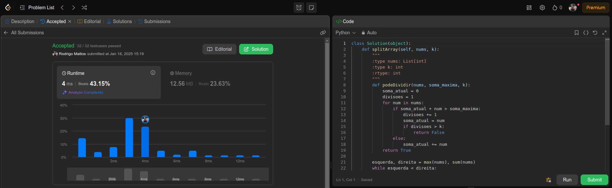

# AlgoritmoAmbicioso_LeetCode

**Número da Lista**: 53 
**Conteúdo da Disciplina**: ALGORITMOS AMBICIOSOS 

## Alunos
|Matrícula | Aluno |
| -- | -- |
| 22/1008688  |  Pedro Paulo Santos Almeida |
| 18/0108875  |  Rodrigo Mattos de Figueiredo Ayres Bezerra |

## Sobre 
O nosso é um projeto de questões do juíz online leetCode, que é um ambiente onde fornece questões de diversos tipos como do mais fácil ao mais difícil para uma boa compreensão sobre os gráfos. Todas as questões estão disṕníveis para qualquer pessoa que deseja ver. 

## Screenshots

**Questão 410**

## Instalação 
**Linguagens**: 
- C 
- Python 

## Uso 
Para usar, deve-se entrar no site do [leetCode](https://leetcode.com/), pesquisar a questão na aba de perguntas e copiar a solução indica e testar no local apropriado no site.

## Vídeo 

## Outros 
| N° Questão | Descrição questão | Dificuldade |
| 410 | [Split Array Largest Sum](https://leetcode.com/problems/split-array-largest-sum/description/) | Hard |
| --- | --- | --- |
| --- | --- | --- |
| --- | --- | --- |
